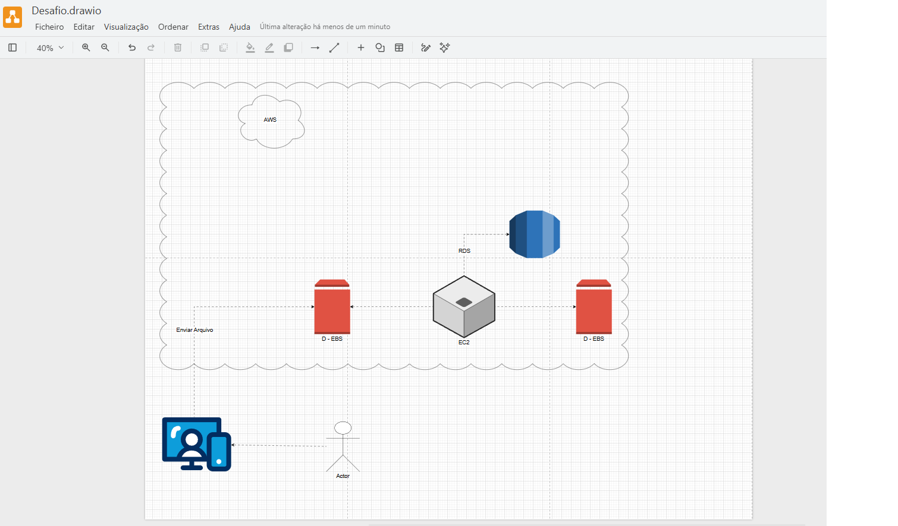
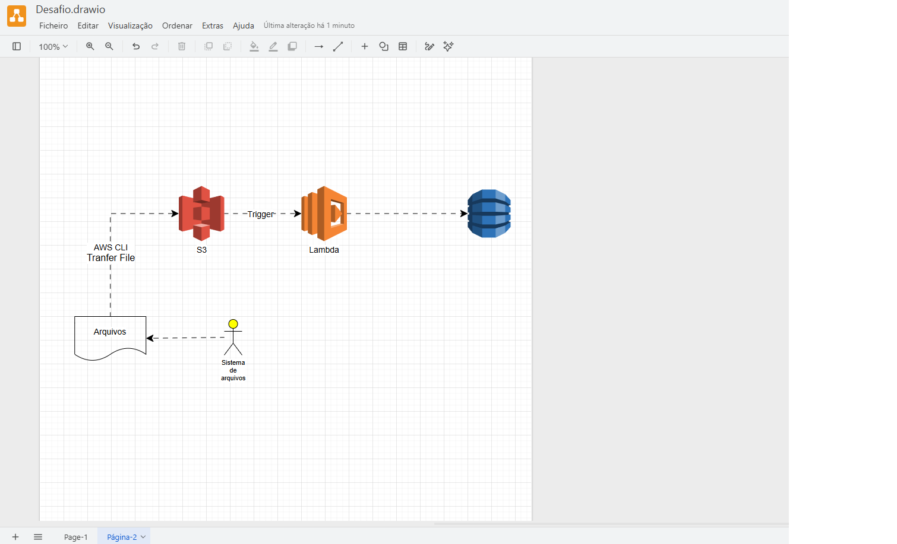

# ☁️ Gerenciamento de EC2 — AMIs e Snapshots EBS

Repositório criado como entregável do desafio prático da [DIO - Digital Innovation One](https://www.dio.me/).

---

## 📌 Sobre o Projeto

Prática de conceitos fundamentais de gerenciamento de instâncias EC2 na AWS, com foco em **criação e utilização de AMIs (Amazon Machine Images)** e **Snapshots EBS**, além da modelagem de arquiteturas usando os serviços da AWS.

---

## 🏗️ Arquiteturas Modeladas

### Diagrama 1 — Arquitetura EC2 com EBS e RDS

Representa uma instância EC2 conectada a dois volumes **D-EBS** (armazenamento em bloco) e a um banco de dados **RDS**, com um usuário enviando arquivos via console AWS.

**Componentes:**
- **EC2** → instância de computação central
- **D-EBS** (x2) → volumes de armazenamento em bloco anexados à instância
- **RDS** → banco de dados relacional gerenciado
- **Actor** → usuário que interage com o ambiente via console
- **Enviar Arquivo** → fluxo de envio de dados para a instância

---

### Diagrama 2 — Pipeline Serverless com S3, Lambda e Banco de Dados

Representa um fluxo de transferência de arquivos via **AWS CLI**, processamento automatizado com **Lambda** e armazenamento em banco de dados.

**Componentes:**
- **AWS CLI** → ferramenta de linha de comando para transferência de arquivos
- **S3** → armazenamento de objetos (destino do upload)
- **Lambda** → função acionada por trigger do S3 para processar o arquivo
- **Banco de Dados** → armazena os dados processados
- **Sistema de Arquivos** → origem local dos arquivos enviados

---

## 📚 Conceitos Praticados

**AMI (Amazon Machine Image)**
- Template que contém o sistema operacional, configurações e software para criar instâncias EC2
- Permite replicar ambientes de forma rápida e padronizada
- Pode ser criada a partir de uma instância existente para backup ou reuso

**Snapshot EBS**
- Cópia point-in-time de um volume EBS
- Armazenado no Amazon S3 de forma incremental (só salva o que mudou)
- Usado para backup, recuperação e criação de novos volumes

---

## 💡 Principais Aprendizados

- **AMIs** permitem "congelar" o estado de uma instância e recriá-la quando necessário
- **Snapshots** são essenciais para estratégias de backup e recuperação de desastres
- É possível criar uma AMI a partir de um Snapshot, conectando os dois conceitos
- O **EBS** persiste dados mesmo após o encerramento da instância — diferente do armazenamento temporário
- Serviços como **Lambda + S3** podem ser combinados com EC2 para arquiteturas híbridas

---

## 🔗 Recursos

- [Documentação Amazon EC2](https://docs.aws.amazon.com/pt_br/ec2/)
- [AMIs - Documentação Oficial](https://docs.aws.amazon.com/pt_br/AWSEC2/latest/UserGuide/AMIs.html)
- [Snapshots EBS - Documentação Oficial](https://docs.aws.amazon.com/pt_br/ebs/latest/userguide/ebs-snapshots.html)

---

## 👨‍💻 Autor

Desenvolvido durante o bootcamp na **[DIO](https://www.dio.me/)**.

